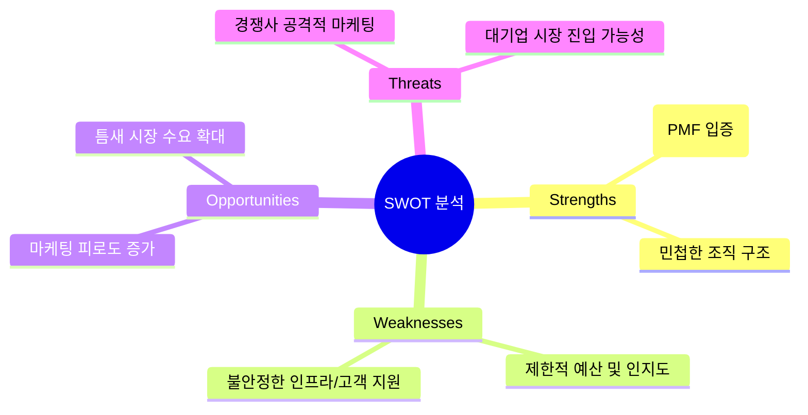

## 프롬프트

- 당신은 회사의 전략기획 업무에 능통한 컨설턴트 입니다. 
아래의 가상의 문제 상황에서 추론하는 프로세스는 제일 먼저 현재의 문제 상황에 대한 깊이있고 심도 있는 분석을 하고 

- 이에 따른 SWOT 분석을 하여 전략적 방향성을 도출한 이후 분기 마케팅 전략을 수립하는 것을 단계적 시나리오 추론 방법을 사용하여 단계적으로 작성해줘

- 가상 문제 상황: (설명 대상인 '초기 스타트업 창업가'가 공감할 만한 상황)

- "최근 앱 출시 후 초기 사용자는 모았으나, 경쟁사 앱의 공격적인 마케팅으로 인해 사용자 증가세가 둔화되었습니다. 다음 분기 마케팅 전략을 새롭게 수립해야 하는 상황입니다."

- SWOT 분석으로 해결

## 결과 ##

# 💡 단계적 시나리오 추론 프로세스

---

## 📚 Table of Contents

* [🧩 Step 1: 현재 문제 상황에 대한 심층 분석 (Deep Dive Analysis)](#-step-1-현재-문제-상황에-대한-심층-분석-deep-dive-analysis)
* [🧭 Step 2: SWOT 분석을 통한 전략적 방향성 도출](#-step-2-swot-분석을-통한-전략적-방향성-도출)

  * [📊 SWOT 시각화 (Mermaid Diagram)](#-swot-시각화-mermaid-diagram)
  * [🎯 결론: 전략적 방향성 (TOWS 매트릭스 적용)](#-결론-전략적-방향성-tows-매트릭스-적용)
* [🚀 Step 3: 다음 분기 마케팅 전략 수립 (실행 계획)](#-step-3-다음-분기-마케팅-전략-수립-실행-계획)

  * [🎯 1. 목표 설정 (Goal Setting)](#-1-목표-설정-goal-setting)
  * [🎯 2. 타겟 재설정 (Refined Targeting)](#-2-타겟-재설정-refined-targeting--틈새-시장-공략)
  * [🎯 3. 마케팅 믹스 전략 (4P 적용)](#-3-마케팅-믹스-전략-4p-기반-실행-계획)
* [✅ 결론](#-결론)

---

## 🧩 Step 1: 현재 문제 상황에 대한 심층 분석 (Deep Dive Analysis)

현재 겪고 계신 **'사용자 증가세 둔화'**의 정확한 원인과 현황을 파악하는 것이 가장 중요합니다.

| 분석 항목            | 주요 질문 (데이터 기반으로 확인 필요)                                                                                        | 목표                                 |
| ---------------- | ------------------------------------------------------------------------------------------------------------- | ---------------------------------- |
| **사용자 유입 분석**    | 초기 사용자 유입 경로는 무엇이었나? (A/B 테스트, 입소문 등) 현재 주요 유입 채널의 효율(CAC)은 어떻게 변화했나?                                      | 기존 유효 채널과 비효율 채널 파악                |
| **경쟁사 분석**       | 경쟁사의 '공격적인 마케팅'의 구체적인 내용은 무엇인가? (대규모 광고, 가격 할인, 신기능 출시 등) 그들의 마케팅 후 우리 앱의 지표(다운로드 수, DAU/MAU)에 어떤 영향이 있었나? | 위협의 성격 및 규모 구체화                    |
| **사용자 이탈/잔존 분석** | 이탈률이 증가했는가? 이탈하는 사용자의 공통점은? 잔존 사용자가 우리 앱을 사용하는 핵심 가치는 무엇인가? (Key Feature)                               | 제품-시장 적합성(PMF) 유지 여부 및 핵심 경쟁 우위 확인 |
| **재무/자원 분석**     | 가용 마케팅 예산은 얼마나 되는가? 마케팅 팀의 인력/역량은 충분한가? (경쟁사 대비)                                                           | 현실적인 전략 실행 범위 설정                   |

> **분석 결과 (가정)**
> 초기 사용자는 ‘특정 기능에 대한 높은 만족도’로 유입되었으나,
> 경쟁사가 대규모 예산으로 ‘유사 기능 + 현금 보상’ 마케팅을 시작하면서 신규 유입은 막히고 일부 기존 사용자도 이탈 징후를 보임.
> 핵심 문제는 **‘경쟁 우위 약화’와 ‘마케팅 예산 및 인지도 열세’**임.

---

## 🧭 Step 2: SWOT 분석을 통한 전략적 방향성 도출

| 카테고리                   | 분석 내용 (Deep Dive 결과 반영)                                                      | 시사점 (전략 방향)                                                      |
| ---------------------- | ---------------------------------------------------------------------------- | ---------------------------------------------------------------- |
| **강점 (Strengths)**     | 1. 핵심 기능에 대한 높은 초기 사용자 만족도 (PMF 입증) 2. 작고 민첩한 조직 구조 (빠른 의사 결정 및 기능 개선 가능) | **S-T 전략:** 핵심 기능을 더욱 특화/고도화하여 경쟁사가 쉽게 모방할 수 없는 ‘진짜’ 차별화 우위 구축   |
| **약점 (Weaknesses)**    | 1. 제한적인 마케팅 예산 및 인지도 (경쟁사 대비 압도적 열세) 2. 불안정한 서버 및 고객 지원 시스템 (성장 시 병목 가능성) | **W-O 전략:** 제한적 예산을 효율이 높은 ‘저비용 마케팅’ 채널(콘텐츠, 커뮤니티)에 집중           |
| **기회 (Opportunities)** | 1. 경쟁사 앱의 ‘돈 찍어내기’ 마케팅에 대한 사용자 피로도 증가 2. 특정 버티컬 시장/틈새 기능에 대한 잠재 수요 증가     | **S-O 전략:** 핵심 만족 기능 기반으로 **특정 틈새 시장(Niche Market)**을 선점 및 집중 공략 |
| **위협 (Threats)**       | 1. 경쟁사의 지속적이고 공격적인 마케팅 (사용자 유입 채널 장악) 2. 대기업의 유사 서비스 시장 진입 가능성 (자본력 우위)   | **W-T 전략:** 마케팅 외적인 요소(제품 완성도, 사용자 경험)에 집중하여 이탈 방지 및 충성도 강화      |

---

### 📊 SWOT 시각화 (Mermaid Diagram)

---

### 🎯 결론: 전략적 방향성 (TOWS 매트릭스 적용)

> **최우선 방향:** `STRENGTH–OPPORTUNITY (SO)` 전략 채택
> **핵심 메시지:**
> “우리의 강점을 기반으로 경쟁사의 약점(마케팅 피로도)과 시장 기회(틈새 수요)를 활용하여,
> 저비용-고효율의 니치 마케팅을 전개하고 제품의 본질적인 차별화를 가속화한다.”

---

## 🚀 Step 3: 다음 분기 마케팅 전략 수립 (실행 계획)

도출된 전략적 방향성(SO 전략)을 **구체적인 실행 계획**으로 전환합니다.
*(가정: 3개월, 다음 분기 실행 기준)*

---

### 🎯 1. 목표 설정 (Goal Setting)

* **KPI:** 신규 사용자 유입 증가율 **15% 달성**
* **핵심 기능 사용자 3개월 잔존율 5%p 개선**

---

### 🎯 2. 타겟 재설정 (Refined Targeting) – 틈새 시장 공략

| 항목     | 기존           | 변경                                                   |
| ------ | ------------ | ---------------------------------------------------- |
| **타겟** | 앱의 일반 사용자 전체 | 핵심 기능에 ‘가장 높은 가치를 부여하는’ 특정 버티컬 그룹 *(예: 프리랜서 디자이너 등)* |

---

### 🎯 3. 마케팅 믹스 전략 (4P 기반 실행 계획)

| 항목                 | 전략 (SO 전략 기반)               | 실행 계획 (다음 분기)                                                                                                                     |
| ------------------ | --------------------------- | --------------------------------------------------------------------------------------------------------------------------------- |
| **Product (제품)**   | 극도의 차별화 및 락인(Lock-in) 전략    | ✅ **킬러 기능 2.0 출시:** 경쟁사가 모방하기 어려운 ‘고도화된 협업 기능’ 또는 ‘AI 기반 자동화’ 기능 1가지 집중 개발 및 출시 ✅ **유료화 모델 실험:** 핵심 기능에 대한 ‘프리미엄 구독 모델’ 테스트 시작 |
| **Price (가격)**     | 가치 기반 가격 전략 (경쟁사 출혈 마케팅 회피) | ✅ **리퍼럴 프로그램 강화:** 기존 사용자 초대 시 혜택 제공 → CAC 절감 ✅ **초기 사용자 평생 할인:** 충성 고객 락인                                                     |
| **Place (채널)**     | 고효율, 저비용, 타겟 특화 채널 집중       | ✅ **틈새 커뮤니티 공략:** 타겟 그룹이 활동하는 전문 커뮤니티/슬랙 채널 중심 바이럴 ✅ **SEO/AEO 강화:** 킬러 기능 관련 키워드 상위 노출 전략                                     |
| **Promotion (홍보)** | 인지도 → 충성도 전환 마케팅            | ✅ **‘본질적 차이’ 콘텐츠 마케팅:** “현금 보상보다 효율이 중요합니다” 메시지 중심 콘텐츠 발행 ✅ **사용자 사례 홍보:** 킬러 기능으로 성공한 고객 스토리 마케팅                              |

---

## ✅ 결론

이러한 단계적 프로세스를 통해,
창업가는 **경쟁사의 공격에 휘둘리지 않고**,
**스타트업의 핵심 강점과 제한된 자원을 가장 효과적으로 활용하는 차별화된 분기 전략**을 수립할 수 있습니다.

---

> 💬 **다음 단계 제안:**
> “이 전략을 실행하기 위한 구체적인 **다음 분기 마케팅 예산 배분 계획**” 수립을 진행할까요?

